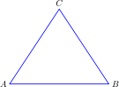

# TikZ 绘图演示

TikZ 是 LaTeX 中最强大的绘图工具之一。在 `posts/` 目录下创建 `.tikz` 文件，运行 `python build_tikz.py` 即可编译为 SVG 图片。

## 简单三角形

## 函数图像

## 有向图

---

*在 `posts/` 目录下创建 `.tikz` 文件，运行 `python build_tikz.py` 编译为 SVG，然后在 Markdown 中用 `` 引用。*
